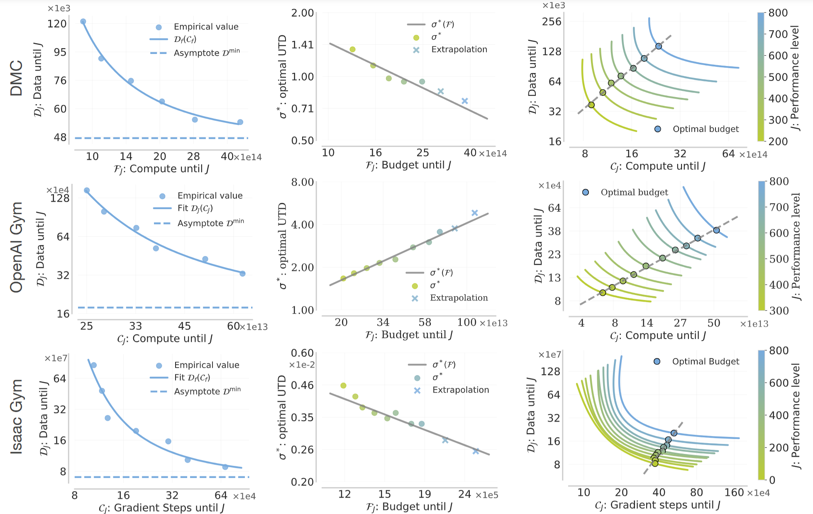

# Value-Based Deep RL Scales Predictably
### [Paper](https://arxiv.org/abs/2502.04327)

Implementation of a workflow for evaluating trade-offs between data efficiency,
compute efficiency, and performance for online RL, validated across multiple
environments.

 [Oleh Rybkin](https://people.eecs.berkeley.edu/~oleh/)<sup>1</sup>,
 [Michal Nauman](https://scholar.google.com/citations?user=GnEVRtQAAAAJ&hl=en)<sup>1,2</sup>,
 [Preston Fu](https://prestonfu.com/)<sup>1</sup>,
 [Charlie Snell](https://sea-snell.github.io/)<sup>1</sup>,
 [Pieter Abbeel](https://people.eecs.berkeley.edu/~pabbeel/)<sup>1</sup>,
 [Sergey Levine](https://people.eecs.berkeley.edu/~svlevine/)<sup>1</sup>,
 [Aviral Kumar](https://aviralkumar2907.github.io/)<sup>3</sup> <br>
 <sup>1</sup>UC Berkeley, <sup>2</sup>University of Warsaw, <sup>3</sup>Carnegie Mellon University



## Installation

QScaled can be easily installed in any environment with Python >= 3.10.
```
pip install -e .
```

## Workflow

We collect run data from the Wandb API using the `BaseCollector` subclasses
defined in [`qscaled/wandb_utils`](qscaled/wandb_utils). Then, we format this
data into zip files, saved to `~/.qscaled/zip` by default. Then, to perform
analysis on this data, we reference these zip files by name in `experiments`.


## Replicate paper results

First, download the zip files from our experiments.
```
bash qscaled/scripts/download_zipdata.sh
```

Using data from our hyperparameter grid search, we can compute the "best" batch 
size $B^{*} (\sigma)$ and learning rate $\eta^{*} (\sigma)$ according to our method.
To perform this analysis for e.g. OpenAI Gym,
```
cd experiments/1_grid_search
python gym_compute_params.py
```
For a closer look at our method, see e.g. [`gym_explore.ipynb`](experiments/1_grid_search/gym_explore.ipynb).


## Replicate our method on your Wandb runs

First, run a hyperparameter grid search over UTD $\sigma$, batch size $B$, 
and learning rate $\eta$, with logging to [Wandb](https://wandb.ai/).
In our experiments, we run 8-10 seeds per configuration.

Using the results of this sweep, we will fit the "best" batch size $B^{*} (\sigma)$ 
and learning rate $\eta^{*} (\sigma)$.

1. Depending on whether you are running one or multiple seeds
   in a single Wandb run, implement a subclass of
   [`OneSeedPerRunCollector`](qscaled/wandb_utils/one_seed_per_run.py) or 
   [`MultipleSeedsPerRunCollector`](qscaled/wandb_utils/multiple_seeds_per_run.py),
   which have example subclass implementations
   [`ExampleOneSeedPerRunCollector`](qscaled/wandb_utils/one_seed_per_run.py)
   and [`ExampleMultipleSeedsPerRunCollector`](qscaled/wandb_utils/multiple_seeds_per_run.py), 
   respectively.
2. Make a copy of [`gym_explore`](experiments/1_grid_search/gym_explore.py).
3. Label your Wandb runs with tags (or, if you don't have many runs,
   skip this step and leave `wandb_tags` as `[]`). You can add tags by 
   selecting runs in the Wandb UI and clicking "Tag".
4. Update the `SweepConfig`.

This procedure takes ~10 minutes!


## Actually, I just want your hyperparameters

See `experiments/outputs/grid_proposed_hparams`. 
* `shared` (**recommended**): Our batch size $B^{*}(\sigma)$ and learning rate 
  $\eta^{*}(\sigma)$ log-linear fits use a shared slope across all tasks within 
  the same benchmark.
* `separate`: We fit $B^{*}(\sigma)$ and $\eta^{*}(\sigma)$ separately for each task.
* `baseline_utd{sigma}`: We compare our approach against taking the best $B$ and $\eta$
  for some given UTD $\sigma$, and reusing the same $B$ and $\eta$ for all other
  UTDs.


## Citation
```
@misc{rybkin2025valuebaseddeeprlscales,
      title={Value-Based Deep RL Scales Predictably}, 
      author={Oleh Rybkin and Michal Nauman and Preston Fu and Charlie Snell and Pieter Abbeel and Sergey Levine and Aviral Kumar},
      year={2025},
      eprint={2502.04327},
      archivePrefix={arXiv},
      primaryClass={cs.LG},
      url={https://arxiv.org/abs/2502.04327}, 
}
```